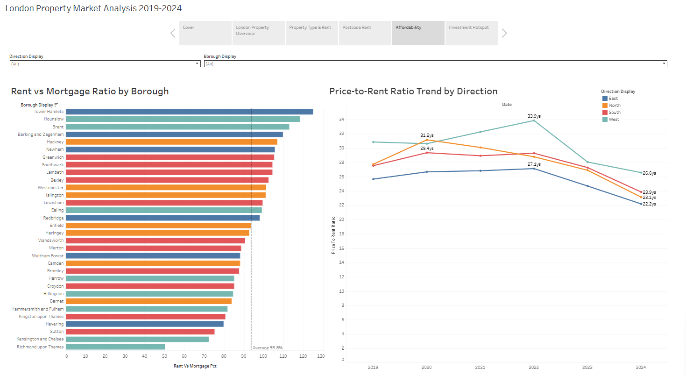

# London Property Market Analysis: Final Report

**32 London Boroughs | 2019–2024**

---

## 1. Executive Summary

Between 2019 and 2024, London's property market reached a turning point: **property prices peaked in 2022 then declined, while rents surged relentlessly**. This price-rent divergence is reshaping the investment landscape across the capital.

Key findings:

- **Prices are correcting.** Most boroughs saw median prices fall 2–5% from their 2022 peaks. In 2024, median prices range from £360,000 (Barking and Dagenham) to £1,200,000 (Kensington and Chelsea).
- **Rents are surging.** Monthly median rents rose 21–50% from 2019 to 2024 depending on room count (averaging 4–8% per year), far outpacing property price growth.
- **Buying is becoming more attractive than renting.** Under standard mortgage assumptions (4.5% rate, 75% LTV, 30-year term), 12 out of 32 boroughs now have monthly rents that **exceed** estimated mortgage payments — up from just 1 borough in 2019.
- **East and South London are the investment hotspots.** Lower entry prices, higher rental yields, and steady price appreciation make these areas the strongest investment propositions.
- **Central and West London favour renters.** High property prices suppress yields; in areas like Richmond upon Thames, mortgage payments are nearly double the rent.

---

## 2. The Big Picture: What Happened from 2019 to 2024?


### Property Prices: Four Years Up, Then a Retreat

From 2019 to 2022, London property prices climbed steadily, fuelled by low interest rates and post-pandemic demand. Across all property types, the market peaked in 2022.

Then the tide turned. The Bank of England's aggressive rate hikes from late 2022 pushed mortgage costs sharply higher, cooling buyer demand. By 2024, most boroughs had seen prices slip back from their highs:

| Property Type | 2019 Median | 2022 Peak | 2024 Median | 2019–2024 Change | Avg Annual |
|---------------|-------------|-----------|-------------|-----------------|------------|
| Detached | £770,000 | £932,000 | £890,000 | +15.6% | +2.9%/yr |
| Semi-detached | £520,000 | £625,000 | £600,000 | +15.4% | +2.9%/yr |
| Terraced | £475,000 | £580,000 | £565,000 | +18.9% | +3.5%/yr |
| Flat/Maisonette | £415,000 | £437,000 | £430,000 | +3.6% | +0.7%/yr |

Flats — the most common property type in London (53% of all transactions) — barely appreciated over five years (+0.7%/yr). For budget-conscious first-time buyers, this stagnation is a potential window of opportunity. Terraced houses, by contrast, showed the strongest growth (+3.5%/yr) and may offer better long-term appreciation.

### Rents: A One-Way Escalator

Unlike prices, rents have shown no sign of slowing down. From 2021 onwards, every room-count category posted significant year-on-year increases:

| Room Count | 2019 Median | 2024 Median | 2019–2024 Change | Avg Annual |
|------------|-------------|-------------|-----------------|------------|
| Studio | £900 | £1,350 | +50.0% | +8.4%/yr |
| 1 Bedroom | £1,239 | £1,500 | +21.1% | +3.9%/yr |
| 2 Bedrooms | £1,400 | £1,800 | +28.6% | +5.2%/yr |
| 3 Bedrooms | £1,625 | £2,150 | +32.3% | +5.8%/yr |
| 4+ Bedrooms | £2,250 | £3,000 | +33.3% | +5.9%/yr |

Studios saw the most dramatic increase (+8.4%/yr), reflecting severe supply-demand imbalance in London's smallest rental units.

**This divergence — stagnant prices and surging rents — is the central story of this report.** It directly drives improving rental yields, shifting affordability dynamics, and emerging investment opportunities explored in the following chapters.

---

## 3. The Rent Map: Where Is It Cheap, and Where Is It Rising?

### Borough Level

The 2024 median monthly rents across London's cheapest and most expensive boroughs:

| Cheapest | Rent | Most Expensive | Rent |
|----------|------|----------------|------|
| Barking and Dagenham | £1,500 | Westminster | £3,491 |
| Bexley | £1,500 | Kensington and Chelsea | £3,302 |
| Croydon | £1,500 | Camden | £2,600 |
| Sutton | £1,500 | Islington | £2,550 |
| Havering | £1,475 | Hackney | £2,383 |

The gap between the cheapest and most expensive boroughs is **2.3x**. But equally important is the pace of change — not all boroughs are rising at the same speed. Brent's median rent surged from £1,350 to £2,250 between 2019 and 2024 (+66.7%), while Barking rose more modestly from £1,200 to £1,500 (+25%).


### Postcode Level: The Variation Within Boroughs

Borough-level averages can mask significant variation at a more granular level. At the postcode level:

- Rent can vary by **£500–1,000/month** within a single borough
- 78 out of 292 London postcodes lack sufficient rental data for analysis

For renters, this means choosing the right postcode within a borough can result in meaningful savings. Borough averages should be treated as a starting point for research, not a final answer.

> **Note:** Postcode-level rental data is derived from ONS non-statistical sampling and should be treated as indicative rather than precise. Use it for directional comparison, not exact benchmarking.

---

## 4. Getting on the Ladder: Entry Prices by Borough and Property Type


### By Property Type

In 2024, the most accessible entry point to London's property market is a Flat/Maisonette at a median price of **£430,000**. However, the five-year growth profile varies significantly across types:

- **Terraced houses** offer the best balance of affordability and appreciation: median £565,000 with +3.5%/yr growth
- **Flats** are the cheapest but have barely grown (+0.7%/yr) — this may suit buyers who prioritise low entry cost over capital gains
- **Detached houses** at £890,000 are effectively out of reach for most first-time buyers

### By Borough

The five boroughs with the lowest median property prices in 2024:

| Borough | Median Price | Direction | 2024 Gross Yield |
|---------|-------------|-----------|-----------------|
| Barking and Dagenham | £360,000 | East | 5.00% |
| Bexley | £385,500 | South | 4.67% |
| Hounslow | £400,225 | West | 5.40% |
| Redbridge | £443,750 | East | 4.46% |
| Enfield | £449,750 | North | 4.27% |

These boroughs cluster in **East London** and share a common profile: lower entry prices combined with above-average rental yields. This combination is explored further in Chapter 6.

---

## 5. Rent or Buy?

### Methodology

For each borough and year, we calculate a **Rent-vs-Mortgage ratio**:

> Rent-vs-Mortgage (%) = Monthly Median Rent ÷ Estimated Monthly Mortgage × 100

**Mortgage assumptions:**
- Term: 30 years, fixed rate
- Interest rate: 4.5% per annum
- Loan-to-Value: 75% (25% deposit)
- Calculation: Standard amortisation formula

A ratio **above 100%** means rent exceeds the mortgage payment — buying is cheaper on a monthly basis (assuming the buyer has the deposit). A ratio **below 100%** means the mortgage costs more than renting.

> ⚠️ This metric compares monthly cash flows only. It does not account for deposit opportunity cost, maintenance, stamp duty, or property value changes. It is designed for cross-borough comparison, not personal financial advice.



### 2024 Results: A Dramatic Shift

**Boroughs where rent now exceeds mortgage payments (ratio > 100%):**

| Borough | Ratio | Monthly Rent | Est. Mortgage | Direction |
|---------|-------|-------------|---------------|-----------|
| Tower Hamlets | 124.8% | £2,300 | £1,843 | East |
| Hounslow | 118.3% | £1,800 | £1,521 | West |
| Brent | 112.8% | £2,250 | £1,995 | West |
| Barking and Dagenham | 109.6% | £1,500 | £1,368 | East |
| Hackney | 106.8% | £2,383 | £2,232 | North |
| Newham | 105.6% | £1,750 | £1,657 | East |
| Greenwich | 105.3% | £1,800 | £1,710 | South |
| Lambeth | 104.3% | £2,100 | £2,014 | South |
| Southwark | 104.3% | £2,200 | £2,109 | South |
| Bexley | 102.4% | £1,500 | £1,465 | South |

**Boroughs where renting is significantly cheaper (ratio < 80%):**

| Borough | Ratio | Monthly Rent | Est. Mortgage |
|---------|-------|-------------|---------------|
| Richmond upon Thames | 50.2% | £2,000 | £3,985 |
| Kensington and Chelsea | 72.4% | £3,302 | £4,560 |
| Sutton | 75.2% | £1,500 | £1,995 |
| Havering | 79.8% | £1,475 | £1,848 |

### The Trend: A Market Tilting Toward Buying

The shift over six years is striking:

| Year | Avg Ratio (All Boroughs) | Boroughs with Ratio ≥ 100% |
|------|-------------------------|---------------------------|
| 2019 | 79.4% | 1 out of 32 |
| 2020 | 75.6% | 0 out of 32 |
| 2021 | 75.5% | 1 out of 32 |
| 2022 | 75.3% | 0 out of 32 |
| 2023 | 83.5% | 4 out of 32 |
| 2024 | 93.8% | 12 out of 32 |

In 2019, renting was cheaper than buying almost everywhere. By 2024, **over a third of London boroughs** have flipped — monthly rent now costs more than a mortgage. This trend is driven by the combination of rising rents and softening property prices, and it fundamentally changes the calculus for anyone deciding whether to rent or buy.

---

## 6. Investment Hotspots: Where to Put Your Money

### Scoring Methodology

Each borough receives an **Investment Score (0–100)** based on two equally weighted components:

| Component | Weight | Calculation |
|-----------|--------|-------------|
| Yield Score | 50% | Average Gross Yield (2019–2024), Min-Max normalised to 0–100 |
| Growth Score | 50% | Property Price CAGR (2019–2024), Min-Max normalised to 0–100 |

> Gross Yield (%) = Annual Rent ÷ Median Property Price × 100
>
> CAGR (%) = (End Price ÷ Start Price)^(1/Years) − 1

**Rating thresholds:**

| Rating | Score | Meaning |
|--------|-------|---------|
| Strong Buy | ≥ 70 | High yield and strong price growth |
| Buy | 50–69 | Solid investment opportunity |
| Hold | 30–49 | Average performance, monitor closely |
| Avoid | < 30 | Weak yield and price growth |


### Results

**Top-rated boroughs:**

| Borough | Score | Avg Yield | Price CAGR | Rating | Direction |
|---------|-------|-----------|------------|--------|-----------|
| Hounslow | 69.6 | 4.93% | 1.94% | Buy | West |
| Barking and Dagenham | 64.8 | 4.52% | 3.04% | Buy | East |
| Bexley | 62.6 | 4.37% | 3.31% | Buy | South |
| Tower Hamlets | 62.2 | 4.92% | -0.02% | Buy | East |
| Newham | 60.8 | 4.67% | 1.00% | Buy | East |

**Bottom-rated boroughs:**

| Borough | Score | Avg Yield | Price CAGR | Rating |
|---------|-------|-----------|------------|--------|
| Harrow | 20.4 | 3.52% | -3.52% | Avoid |
| Kensington and Chelsea | 21.1 | 2.90% | 0.34% | Avoid |

### What the Numbers Tell Us

**1. Tower Hamlets — the yield champion.** Property prices have been essentially flat over five years (CAGR -0.02%), but rents surged from £1,733 to £2,300/month. The result: a 2024 Gross Yield of 5.69% — the highest in London — and a rent-vs-mortgage ratio of 124.8%. For yield-focused investors, Tower Hamlets is the standout opportunity.

**2. Hounslow — the balanced pick.** The highest average yield in the dataset (4.93%) combined with steady price growth (CAGR 1.94%) makes Hounslow the most balanced investment across both dimensions.

**3. Harrow — proceed with caution.** The only borough with significant price decline (CAGR -3.52%), paired with a below-average yield of 3.52%. Both pillars of the investment case are weak.

**4. The geography of value.** Three of the top 5 boroughs are in East London, one in South, one in West. East London's combination of low entry prices (£360,000–£486,000) and high rental demand makes it the strongest investment corridor. Central and West London boroughs score lower because high purchase prices (£773,000–£1,200,000) compress yields below 3.5%.

---

## 7. Conclusions and Recommendations

### For Renters

- **On a tight budget:** Barking and Dagenham, Bexley, Croydon, and Sutton offer the lowest median rents at £1,500/month. The trade-off is longer commute times.
- **Use postcode-level data:** Within the same borough, choosing the right postcode can save £500+/month. Borough averages are a starting point, not the answer.
- **Studios have risen the most** (+50% since 2019, or +8.4%/yr). If you're renting a studio, comparison shopping across boroughs and postcodes is especially important.
- **Consider buying if you can:** In 12 boroughs, monthly rent now exceeds what a mortgage would cost. If you have a deposit, the monthly economics of buying have shifted significantly in your favour.

### For Investors

- **High-yield targets:** Tower Hamlets (Yield 5.69%), Hounslow (5.40%), and Barking and Dagenham (5.00%) offer the strongest rental returns in 2024.
- **Growth targets:** Richmond upon Thames (Price CAGR 10.42%) and Kingston upon Thames (7.19%) lead on price appreciation, though yields are lower.
- **Balanced approach:** Hounslow (Score 69.6) and Bexley (62.6) deliver both reasonable yields and steady price growth.
- **Timing consideration:** Prices are softening while rents continue to rise, pushing yields upward. If this trend continues, the current window may offer favourable entry points for yield-focused strategies.

### Limitations

- Rental data is based on ONS non-statistical sampling; trends should be treated as indicative (see Appendix A)
- The Investment Score is a simplified model that does not factor in crime rates, transport links, school quality, or local development plans
- Mortgage estimates assume fixed parameters (4.5%, 75% LTV, 30 years); individual circumstances will vary

### Potential Extensions

- Incorporate crime rate data for a safety-adjusted investment score
- Add transport connectivity (distance to tube/rail stations) as a pricing factor

---

## Appendix A: Data Sources and Limitations

| Data | Source | Period | Scale |
|------|--------|--------|-------|
| Property Transactions | HM Land Registry – Price Paid Data | 2019–2024 | ~600,000 London transactions |
| Private Rental Market | ONS – Private Rental Market Summary Statistics | 2019–2024 | Borough and Postcode level |

**Property price data** covers completed residential transactions only. Off-market sales and non-residential properties are excluded. City of London is excluded due to minimal residential transaction volume.

**Rental data** is based on a non-statistical sample from administrative records. The ONS states:

> "The sample used to produce these statistics is **not statistical** and may **not be consistent over time**, as such these data **should not be compared across time periods** or between areas."

All rental-based metrics in this report (yield, rent trends, affordability ratios) should be interpreted with this caveat in mind. Rental trends are presented as indicative patterns, not precise measurements.

---

## Appendix B: Methodology and Metric Definitions

### Data Pipeline

```
Download → Clean → Analyse → Visualise
```

1. **Download**: Automated scripts fetch raw data from Land Registry and ONS
2. **Clean**: Filter to London, standardise borough names, remove outliers (IQR method), align datasets
3. **Analyse**: 9-phase Python pipeline producing 11 analytical CSVs
4. **Visualise**: 5 interactive Tableau Public dashboards

### Metric Definitions

| Metric | Definition |
|--------|-----------|
| Median Price | Median transaction price per borough per year |
| Median Rent | Median monthly rent per borough per year |
| Gross Yield (%) | (Annual Rent ÷ Median Price) × 100 |
| Price-to-Rent Ratio | Median Price ÷ Annual Rent (years of rent to equal purchase price) |
| YoY Growth (%) | Year-over-year percentage change |
| CAGR (%) | Compound Annual Growth Rate (2019–2024) |
| Price / Rent Index (2019=100) | Rebased index for trend comparison |
| Rent-vs-Mortgage (%) | Monthly Rent ÷ Estimated Monthly Mortgage × 100 |

### Mortgage Estimation Parameters

- Loan term: 30 years
- Interest rate: 4.5% per annum (fixed)
- Loan-to-Value: 75% (25% deposit)
- Formula: Standard amortisation (equal monthly payments)

### Investment Score Calculation

- **Yield Score (50%)**: Average Gross Yield across 2019–2024, Min-Max normalised to 0–100
- **Growth Score (50%)**: Property Price CAGR (2019–2024), Min-Max normalised to 0–100
- **Total Score** = Yield Score × 0.5 + Growth Score × 0.5
- **Ratings**: Strong Buy (≥70) / Buy (50–69) / Hold (30–49) / Avoid (<30)

---

## Appendix C: Dashboard Guide

| # | Dashboard | Corresponding Chapter |
|---|-----------|----------------------|
| 1 | London Property Overview | Chapter 2: The Big Picture |
| 2 | Property Type & Rent Analysis | Chapters 3–4: Rent Map and Entry Prices |
| 3 | Postcode Rent Analysis | Chapter 3: Postcode-Level Variation |
| 4 | Affordability Analysis | Chapter 5: Rent or Buy |
| 5 | Investment Hotspot Analysis | Chapter 6: Investment Hotspots |

**[View Interactive Dashboard on Tableau Public](https://public.tableau.com/app/profile/jun.chung.wu/viz/LondonPropertyMarketAnalysis2019-2024/LondonPropertyMarketAnalysis2019-2024)**

---

**Author**: Kerry Wu
**Tools**: Python · MySQL · Tableau Public
**Last Updated**: March 2026
