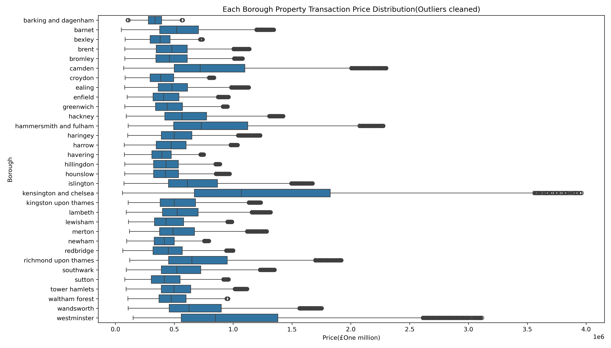
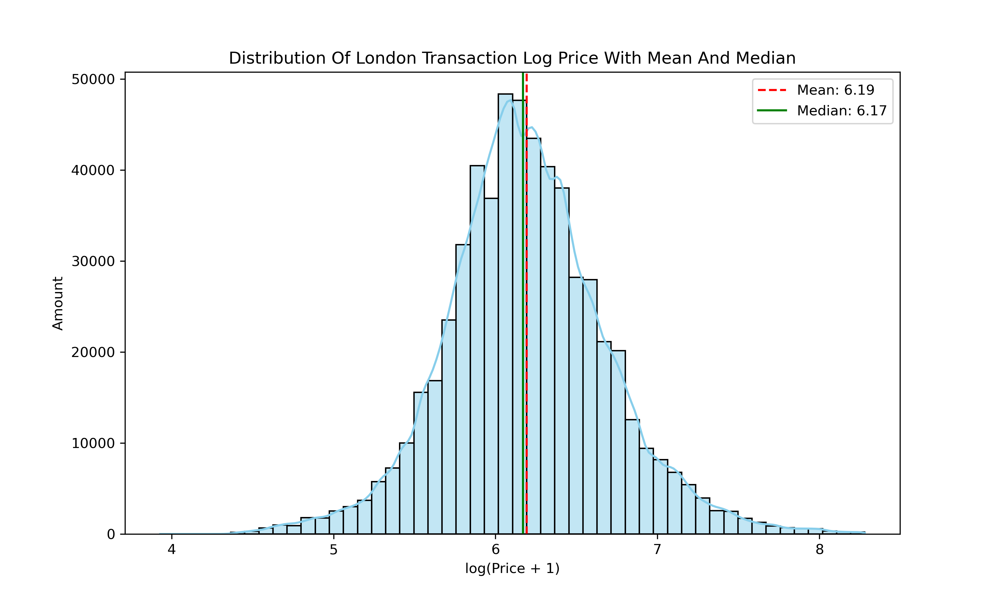
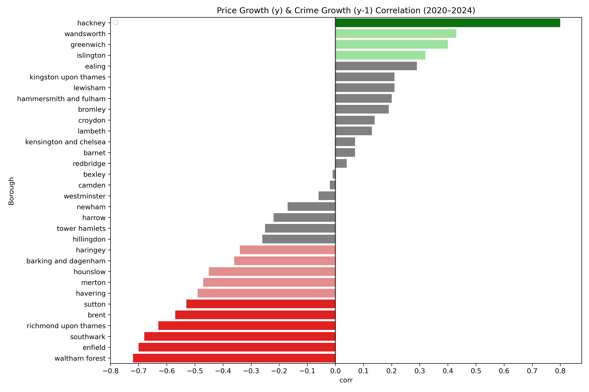
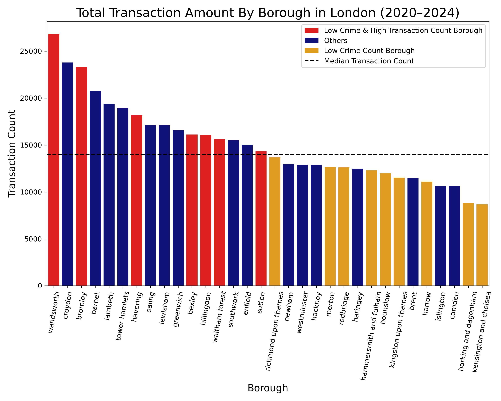
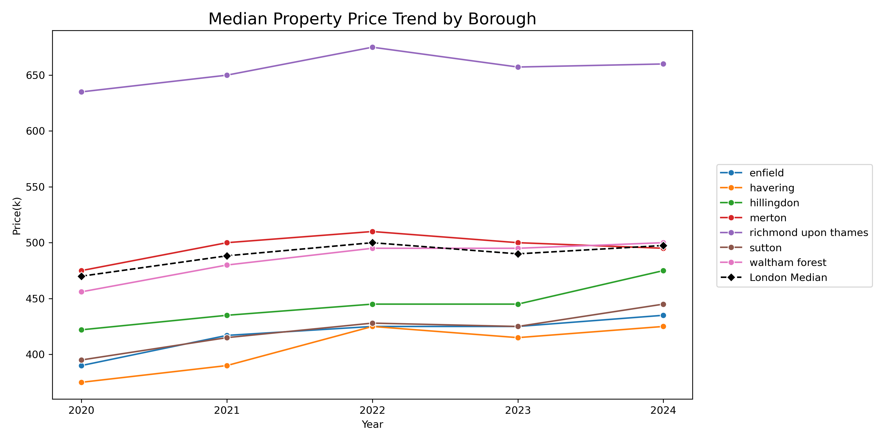

# 🏙️ A Multidimensional Analysis of Housing Prices and Crime Rates  
## Enhancing Transparency and Decision-Making in the London Real Estate Market

---

## 📌 Project Overview

As concerns around residential safety and investment returns continue to rise, relying solely on housing price trends is no longer sufficient for evaluating an area’s true value.  
This project focuses on housing and crime data across London boroughs from **2020 to 2024**, using cross-dimensional analysis to identify areas where property prices have steadily increased while crime rates have decreased or stabilized.

> 🎯 **Goal**:  
To support real estate companies in London with data-backed sales strategies and stronger regional positioning.  
For potential buyers, the findings offer a more holistic view of each borough’s prospects.  
Ultimately, this analysis aims to enhance market transparency, optimize decision-making, and improve the overall efficiency of real estate transactions.

---

## 🗂️ Data Sources & Tools Used

### 📊 Data Sources

This study is based on two primary datasets:

- **Housing Price Data**  
  Sourced from the UK Government’s official *Price Paid Data* dataset ([link]), which contains approximately 1 million records per year.  
  Each record includes transaction amount, date, and borough location.

- **Crime Data**  
  Retrieved from the *London Datastore* ([link]), provided by the Greater London Authority.  
  The dataset consists of around 80,000 records, covering crime types, incident counts, and date of occurrence.

> To account for the lagging nature of housing prices in response to safety conditions, the analysis compares **property prices in a given year** with **crime data from the previous year**.

📅 **Data Period Covered**:
- Housing Price Data: *2019 to 2024* 
- Crime Data: *2018 to 2024*

---

## 🛠 Tools & Workflow

The data analysis process was conducted using the following tools:

- **SQL**  
  Used for fundamental data filtering, preprocessing, and initial queries.

- **Python** (`pandas`, `matplotlib`, `seaborn`)  
  Applied for advanced data cleaning, merging datasets, and performing exploratory data analysis (EDA).

- **Tableau**  
  Utilized for interactive visualization, allowing stakeholders to intuitively explore trends and insights.

---

## 🧹 Data Preparation & Cleaning

### SQL Stage – Initial Filtering and Location Matching

- Used **MySQL** to merge annual housing price tables and standardize borough naming.
- Applied spatial filtering logic (similar to Venn diagram logic) to retain only data fully within Greater London by joining with borough boundary tables.
(This logic is essentially about identifying the intersection of the three fields to ensure the data truly belongs to the administrative area of Greater London.)
- Identified three categories:
  1. Borough, county, and outward code all match London – ✅ ideal data.
  2. Missing outward code – mostly null and input errors were excluded.
  3. Outward code matched but marked as `outer` – also excluded.
- Extracted transaction date for Python-based feature engineering.
- Repeated the same cleaning process for each annual housing dataset.

### Python Stage – Outward Code Imputation & Border Handling

- Merged all housing and crime data into two large tables (housing: 712,435 rows; crime: 70,102 rows).
- For rows with missing outward code:
  - Built a lookup table grouped by county, borough, and town to fill in missing codes.
  - If multiple outward codes were possible, used the mode (most frequent).
- For rows with valid postcode but invalid borough:
  - Corrected borough using a custom dictionary.
  - Reset county to "Greater London" .
  - Fully excluded rows identified as true outer-London (label `p` + border).
- Added derived columns: year, quarter, month, and compass direction for Tableau visualization.

### Crime Data Processing

- Merged two raw tables with no missing values.
- Removed rows where monthly crime count = 0.
- Standardized all borough names to lowercase.
- Added year, quarter, month, and directional columns for Tableau use.

### Outlier Removal

#### 🏠 Housing Data:
- Removed property price records over £5,000,000 or under £50,000.
- Used boxplots by borough to visually assess price spread.
- Applied **IQR filtering** (`Q1 - 1.5*IQR`, `Q3 + 1.5*IQR`) to remove borough-level price outliers.
- Final log-transformed price distribution showed close alignment between mean and median, confirming successful outlier handling.

#### 🚨 Crime Data:
- For each borough, compared crime count by year.
- Flagged and removed cases where **any single year’s crime count exceeded the previous year by more than 3×**.
- This was used to catch likely data entry errors or anomalous spikes.

## 🔍 Key Insight

By integrating multi-year housing price data with borough-level crime statistics, this project reveals a shifting real estate dynamic in London from **2020 to 2024**.  
Our analysis highlights that **post-pandemic behavioural shifts and safety trends** are reshaping investment potential across the city:

---

### ❓ Question 1: Has the shift in residential behaviour after the pandemic reshaped housing market trends across London’s boroughs? Has the crime rate been affected as well?

➡️ **Outer boroughs such as Hillingdon and Havering are gaining momentum**, combining **relative affordability** with **improved safety**.

---

### ❓ Question 2: What is the correlation between the trend in crime rate changes and property price fluctuations across London’s boroughs?

➡️ A **clear negative correlation between crime growth and property value** suggests that **public safety is a meaningful driver** of housing resilience.

---

### ❓ Question 3: Among the boroughs with low crime rates, are there certain areas where property transaction volumes and median prices are relatively high?

➡️ **Flats and terraced houses remain stable choices overall**, while **semi-detached homes show growth potential** in selected areas.

---

### ❓ Question 4: Is it possible to identify “high-potential” boroughs—areas where crime rates are stabilising or improving, and property prices remain relatively affordable?

➡️ **Emerging “high-potential zones” offer attractive entry points** for **cautious investors** and **first-time buyers**, marked by **stable crime rates**, **strong transactions**, and **still-accessible pricing**.

---

### ❓ Question 5: Among these areas, which types of properties (detached, semi-detached, terraced, flats, etc.) demonstrate stronger resilience to fluctuations in crime rates while maintaining healthy transaction activity?

➡️ These findings suggest that **London’s housing resilience is decentralising**, with **opportunity expanding beyond traditionally sought-after central zones**—especially in **safer, well-connected outer areas**.

## 📊 Visualizations

### 1. Borough-Level Correlation Between Price and Crime Growth (2020–2024)

This horizontal bar chart displays the correlation between **property price growth (year y)** and **crime growth in the previous year (y-1)** across all London boroughs.  

---

### 2. Total Transaction Volume by Borough (2020–2024)

This bar chart illustrates the **total number of property transactions** per borough over the 5-year period.

---

### 3. Median Property Price Trends for Selected Boroughs (2020–2024)

This line chart tracks the **annual median property price** for selected boroughs, with **London-wide median** as a reference.

---

## 🚀 Future Work

Future Opportunities for Expansion
This project lays a strong foundation for more advanced, data-driven exploration of London’s property market. Future development could expand in several promising directions:

Postcode- or LSOA-level analysis: As more detailed housing data becomes available—particularly from 2025 onward—analysis can shift to finer geographic units to uncover hyperlocal trends and identify high-potential micro-markets.

Crime category segmentation: Investigating the distinct effects of different crime types (e.g. violent, property, drug-related) on housing values may reveal nuanced patterns in buyer perception and neighbourhood desirability.

Predictive modelling and forecasting: Using regression or machine learning techniques to model future price trends based on spatial, socio-economic, and crime-related features could help inform smarter investment and policy decisions.

By continuing to refine this multidimensional approach, future work can deliver even more actionable insights—empowering urban planners, real estate professionals, and local residents alike to make better-informed decisions in a changing city.

## 📁 Project Structure

london_property_and_crime_data/
├── data/ # Raw、cleaned and mapping datasets
├── notebooks/ # Jupyter notebooks for EDA and analysis & SQL scripts for data cleaning
├── charts/ # Exported visualization images
├── final_report.md # Summary of insights and recommendations
└── README.md # Project overview and instructions

## ▶️ How to Run

This project can be explored in two ways: using Python notebooks or through SQL-based data preprocessing.

### 🧪 Python (Recommended)

1. Navigate to the Jupyter notebook in the `notebooks/` folder.
2. Load the **cleaned datasets** from the `data/` folder.
3. Start from **Block #41** (marked with `# ⭐ starting point`) to explore the core analysis and visualizations.

### 🗂 File Locations

- All visualizations are saved in the `charts/` folder.
- Final insights are summarized in `final_report.md`.

---

### 🛢️ SQL (Optional – For Data Cleaning from Raw Files)

If you prefer to reproduce the data cleaning pipeline using SQL:

1. Use the **`import_data.sql`** script to load raw property data into your SQL environment.
2. Run the **`data_cleaning.sql`** script to clean the imported data.
3. Repeat for each property raw dataset individually (one SQL execution per file).

