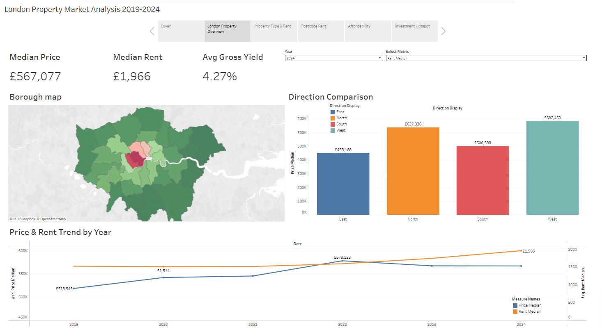

# London Property Market Analysis 2019–2024

Analysing property prices and rents across 32 London boroughs — from raw government data to interactive dashboards.

**[View Interactive Dashboard on Tableau Public](https://public.tableau.com/app/profile/jun.chung.wu/viz/LondonPropertyMarketAnalysis2019-2024/LondonPropertyMarketAnalysis2019-2024)**

---

## Why This Project?

As a foreign young professional working in London, I've had my fair share of struggles with renting. Every time I moved, the same questions came up: Am I overpaying? Why does rent vary so much within the same borough? If I save enough for a deposit, where should I buy — and is buying even worth it compared to renting?

Listing websites show you today's price, but they don't show you trends, don't help you compare across boroughs, and certainly don't tell you which areas might be undervalued.

So I decided to build it myself — using publicly available UK government data to create an analytical tool that tracks rents, compares property prices, and surfaces potential investment opportunities across London.

---

## Questions This Project Answers

1. **What happened to London's property market from 2019 to 2024?** — Price peaks, corrections, and the rental surge
2. **Where is rent affordable — and where is it rising fastest?** — Borough and postcode-level rent comparison
3. **What does it cost to get on the property ladder?** — Entry prices by borough and property type
4. **Is it cheaper to rent or buy?** — Affordability analysis comparing monthly rent to estimated mortgage payments
5. **Where are the best investment opportunities?** — A scoring system combining rental yield and price growth

---

## Key Findings

### The Big Picture

- Most boroughs saw property prices **peak in 2022 then decline** into 2023–2024, while **rents continued to climb** — rental growth has outpaced price growth across the board since 2021.
- 2024 median prices range from **£360,000** (Barking and Dagenham) to **£1,200,000** (Kensington and Chelsea).
- 2024 median monthly rents range from **£1,500** (outer boroughs) to **£3,491** (Westminster).

### Where Is Rent Cheapest?

| Cheapest (2024 Median Rent) | Most Expensive |
|-----------------------------|----------------|
| Barking and Dagenham — £1,500 | Westminster — £3,491 |
| Bexley — £1,500 | Kensington and Chelsea — £3,302 |
| Croydon — £1,500 | Camden — £2,600 |
| Sutton — £1,500 | Islington — £2,550 |

Within a single borough, rent can vary by **£500–1,000/month** at the postcode level. Out of 292 London postcodes, 78 lack sufficient rental data for analysis.

### Rent or Buy?

Using the Rent-vs-Mortgage ratio (monthly rent ÷ estimated monthly mortgage):

- **Ratio > 100%** (e.g. Tower Hamlets 124.8%, Hounslow 118.3%) — rent **exceeds** the mortgage payment; **buying is cheaper on a monthly basis**
- **Ratio < 80%** (e.g. Richmond 50.2%) — mortgage payments far exceed rent; **renting is significantly cheaper**

In 2019, only 1 out of 32 boroughs had rent exceeding mortgage costs. By 2024, that number has risen to **12 out of 32** — the market is tilting decisively toward buying.

> Note: Mortgage estimated at 30-year term, 4.5% interest rate, 75% LTV (25% deposit). Actual costs depend on individual circumstances.

### Where to Invest?

A composite Investment Score (0–100) combining average Gross Yield and Price CAGR (2019–2024):

| Borough | Score | Avg Yield | Price CAGR | Rating |
|---------|-------|-----------|------------|--------|
| Hounslow | 69.6 | 4.93% | 1.94% | Buy |
| Barking and Dagenham | 64.8 | 4.52% | 3.04% | Buy |
| Bexley | 62.6 | 4.37% | 3.31% | Buy |
| Tower Hamlets | 62.2 | 4.92% | -0.02% | Buy |
| Newham | 60.8 | 4.67% | 1.00% | Buy |

**East and South London** consistently score highest — lower entry prices drive higher yields, while many of these boroughs also show solid price appreciation. Central and West London boroughs score lower due to high prices suppressing yield percentages.

---

## Dashboards




| # | Dashboard | What It Answers |
|---|-----------|-----------------|
| 1 | **London Property Overview** | What does the market look like? Price and rent trends, borough map, KPIs |
| 2 | **Property Type & Rent Analysis** | How much do different property types and bedroom counts cost? |
| 3 | **Postcode Rent Analysis** | How does rent vary within a borough at postcode level? |
| 4 | **Affordability Analysis** | Is it cheaper to rent or buy in each borough? |
| 5 | **Investment Hotspot Analysis** | Which boroughs offer the best investment potential? |

---

## Data Sources

| Data | Source | Link |
|------|--------|------|
| Property Transactions | HM Land Registry – Price Paid Data | [gov.uk](https://www.gov.uk/government/collections/price-paid-data) |
| Rental Market | ONS – Private Rental Market Summary Statistics | [ons.gov.uk](https://www.ons.gov.uk/peoplepopulationandcommunity/housing/datasets/privaterentalmarketsummarystatisticsinengland) |

### Data Caveats

- **Property prices** cover completed residential transactions only; off-market sales are excluded.
- **Rental data** is based on a non-statistical sample. The ONS states: *"These data should not be compared across time periods or between areas."* Rental trends in this project are indicative, not precise.
- **City of London** is excluded due to minimal residential transactions.

---

## Technical Overview

### Pipeline

```
Download → Clean → Analyse → Visualise
```

| Phase | Description |
|-------|-------------|
| Download | Automated scripts fetch raw data from Land Registry and ONS |
| Clean | Filter to London, standardise borough names, remove outliers (IQR), align datasets |
| Analyse | 9-phase Python pipeline computing metrics across multiple dimensions |
| Visualise | 5 interactive Tableau Public dashboards |

**Tools**: Python (Pandas, NumPy) · MySQL · Tableau Public

### Project Structure

```
london_property/
├── main.py                     # Run full pipeline with one command
├── scripts/
│   ├── download_price.py       # Download Land Registry data
│   ├── download_rent.py        # Download ONS rental data
│   ├── clean_price.py          # Clean price data (MySQL)
│   ├── clean_rent.py           # Clean rental data
│   └── analysis.py             # 9-phase analysis → 11 output CSVs
├── tableau_output/             # Analysis results for Tableau
├── property_price/             # Raw price data
├── property_rent/              # Raw rental data
├── lookup_table/               # Reference tables
└── map/                        # Shapefiles for map visualisations
```

### How to Run

```bash
# Full pipeline
python main.py

# Manual update (when new data is published)
python scripts/download_price.py --year 2025
python scripts/download_rent.py --search
python scripts/download_rent.py --year 2025
python scripts/clean_price.py
python scripts/clean_rent.py
python scripts/analysis.py
```

---

## Author

Kerry Wu
